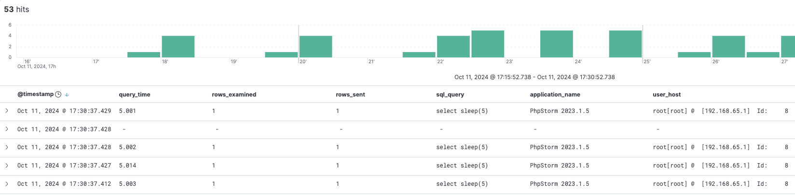

# hsa-slow-query-log

# Task

Set up MySQL with slow query log.

Configure ELK to work with mysql slow query log.

Configure GrayLog2 to work with mysql slow query log.

Set different thresholds for long_query_time (0, 1 , 10) and compare performance.

# How to start

1. Navigate to repository root and run `docker-compose up -d`

# How to test

1. After all is start up navigate to `localhost:5601` (Kibana)
   1. Create data view for wildcard `mysql-slow-queries-*` indices
2. Connect via DB editor tool of your choice to MySQL server at `localhost:3306`
3. Execute there command `select sleep(5);`
4. Go to Kibana, observe collected slow log
   1. 